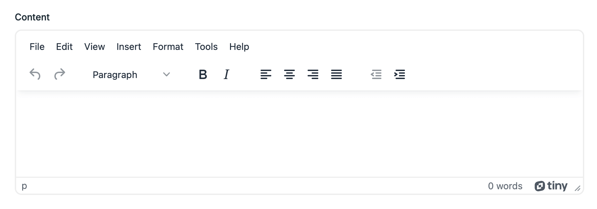
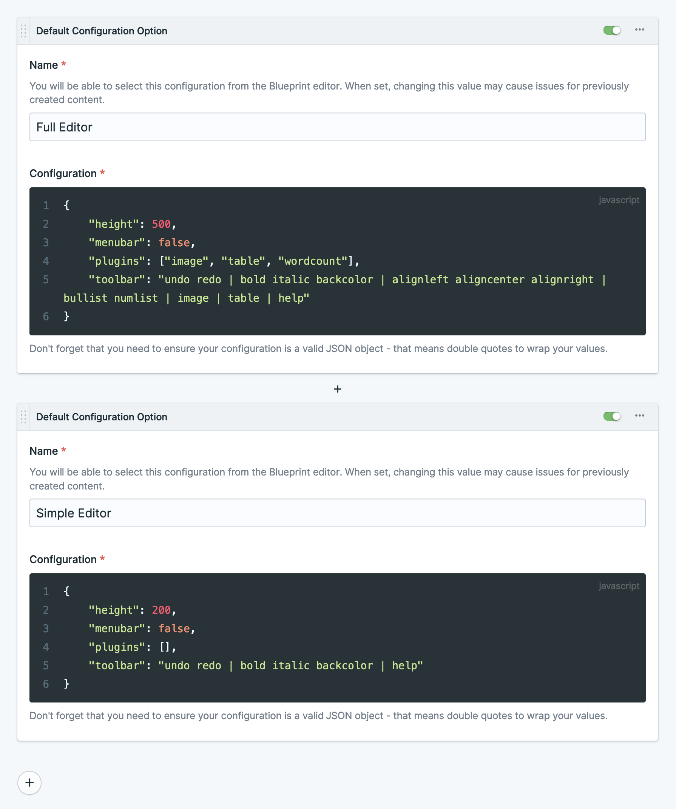

# TinyMCE Cloud Fieldtype for Statamic 3

<!-- statamic:hide -->


[](https://packagist.org/packages/mitydigital/statamic-tinymce-cloud/stats)

---

<!-- /statamic:hide -->

> A TinyMCE Cloud fieldtype for Statamic.

This is a TinyMCE Cloud Fieldtype for Statamic 3 utilising the cloud-hosted version of TinyMCE.

This requires a free API key from [tiny.cloud](https://www.tiny.cloud), and simplifies your build steps as the cloud
version will always run the latest version from Tiny, and doesn't need to be included in your app's bundle.

In the configuration you are able to choose which TinyMCE version you want to use - you now have the choice of 
TinyMCE 6 or TinyMCE 5.



## What can it do?

TinyMCE provides a WYSIWYG editing experience for content authors, and can be easily extended through custom plugins -
which is great when you need an editor to insert content from other parts of your application.

This TinyMCE addon allows you to:

- Select from either TinyMCE 5 or TinyMCE 6
- Create multiple configurations for different use cases
- Apply one of your configuration to each TinyMCE Cloud fieldtype usage

### Why use the Tiny Cloud-hosted version of TinyMCE?

TinyMCE can be either self-hosted or hosted through Tiny Cloud.

This fieldtype uses the Tiny Cloud method.

This means that as Tiny release updates to TinyMCE, the cloud-hosted version will receive them without you needing to
update your dependencies, re-build and re-deploy your codebase.

When using the Tiny Cloud version of TinyMCE, you still can configure TinyMCE as if you were running the self-hosted
version, and take advantage of your own external plugins too - these need to be built as part of your project, and
hosted with your project.

To use the Tiny Cloud version of TinyMCE, you need a [free API key from Tiny](https://www.tiny.cloud). When you have
your key set up, you can also take advantage of Tiny's Premium plugins if needed.

---

## Installation

This Addon is for **Statamic 3.3+**.

Install it via the composer command

```
composer require mitydigital/statamic-tinymce-cloud
```

Publish the configuration file. This will create `tinymce-cloud.php` in your config/statamic folder.

```
php artisan vendor:publish --tag="statamic-tinymce-cloud-config"
```

Add `TINYMCE_CLOUD_APIKEY` to your .env file, and set your API key from [tiny.cloud](https://www.tiny.cloud).

```
TINYMCE_CLOUD_APIKEY="YOUR_API_KEY"
```

This will get passed on to the TinyMCE fieldtype instance automatically - you don't need to include this in each of 
your TinyMCE configurations.

### Upgrading from v1.x

v2.x is a major upgrade from v1.x.

#### What's changed:

- Configuration setup and use is completely 
- Support for the "Cloud Channel" editor config option
- Permission has been added
- Support for Statamic 3.3+ only

Upgrading is simple - but given the changes are rather large, work through these steps one-by-one.

#### 1. Make a manual copy of any TinyMCE Configurations

In v1.x, configurations were stored with each fieldtype instance. v2.x now stores configuration centrally, and gets
referenced by each fieldtype.

Before you do anything, go through your Blueprints and make a note of your TinyMCE configurations used. You'll need
these after you upgrade, and going through before you upgrade just helps not lose anything.

#### 2. Update your composer.json file

Update to v2.x by updating your composer.json file, and running `composer update`.

```json
# Before: 
"mitydigital/tinymce-cloud": "^1.0",
        
# After: 
"mitydigital/tinymce-cloud": "^2.0",
```

#### 3. Set TinyMCE Cloud Configuration

In Statamic, under *Tools*, go to *TinyMCE Cloud*.

Set your preferred Cloud Channel, and create your Configuration sets. Read the [configuration](#configuration) section
for more details on the new Configuration setup.

Here you'll use the configurations you manually made note of from step 1. Aren't you glad you make a copy now?

#### 4. Update your TinyMCE Cloud fieldtype instances

Edit each Blueprint where you're using a TinyMCE Cloud fieldtype, and edit its configuration. From your list of
Configuration Options, select the configuration you want to use for that instance, and Save.

*Optional:* If you like to keep things clean, you may want to manually edit each Blueprint yaml file and remove
the `init` property from the v1.x version of the addon. It's no longer used in v2.x, and won't cause harm if it is left
there, but for cleanliness, you may want to remove it.

#### 5. Optional: Update Roles

If you want to restrict access to the TinyMCE Cloud configuration view, you can update your roles to add/remove the 
"View TinyMCE Cloud configuration" permission.

Phew, done all that? You're now good to go.

---

## Configuration


Within Statamic, under Tools, you will see **TinyMCE Cloud**. This is where you can configure your TinyMCE Cloud
fieldtypes.

### Cloud Channel

The Cloud Channel is the TinyMCE version you wish to load - either TinyMCE 5 or TinyMCE 6.

The default is TinyMCE 6.

### Default TinyMCE Configurations

In v1.x, each fieldtype instance had its own configuration - which was a nuisance if you needed to make the same change
to multiple instances. In v2.0+, configuration is now stored centrally, and is simply applied to your TinyMCE Cloud
fieldtype instances.

You can create as many Configurations as you need - one, two, four, whatever you like. You'll need at least one though.

Give each Configuration a Name and a TinyMCE Configuration Object.

Whatever your **first** configuration set is will be the default for any new TinyMCE Cloud fieldtypes. All options in 
the fieldtype configuration will be sorted alphabetically for ease-of-reading, and having a default just makes life 
easier.

**Important Note**: outside of Statamic, your TinyMCE Configuration Object is just a JavaScript object. However, to take
advantage of JSON validation within Statamic, you need to ensure your configuration is valid JSON - this means you must
be using double quotes (instead of single quotes). If you're unsure why it is failing, run your configuration through a
JSON validator (such as [JSON Lint](https://jsonlint.com/)) to check your syntax and get more detail on the specifics of
your setup.



Refer to [TinyMCE's documentation](https://www.tiny.cloud/docs/) for full configuration options.

Note that Statamic 3 uses Vue, and in turn, this fieldtype uses the TinyMCE Vue component which does **not** require
your API key to be part of the ``init`` call. Your API key is passed as a separate property to the component from your
.env file.

The Tiny Cloud API key has been added to the .env file, rather than the Statamic configuration screen, to make it easier
to keep environment settings separate from initialisation configuration, especially when different keys may be used for
different environments, allowing you to keep environment configuration settings outside of your source control.

All TinyMCE Cloud configuration is written to the `tinymce-cloud.yaml` file within Statamic's content folder, and can be
safely included in your site's source control.

## Using external plugins ##

[External plugins](https://www.tiny.cloud/docs/configure/integration-and-setup/#external_plugins) can be added to your
TinyMCE configuration using the `external_plugins` configuration option.

Using external plugins is identical to when you use a self-hosted version of TinyMCE. Take care to ensure your plugin
definition URLs are publicly accessible, and either relative to the site's root or absolute.

```json
{
  "external_plugins": {
    "my_plugin_name": "/plugins/my_plugin_name/plugin.min.js"
  },
  "toolbar": "... my_plugin_name ..."
}
```

The building of your plugin files needs to be part of your site's build steps. Make sure that the build files end up in
your site's public folder.

## Access control

A permission has been created with this addon to help you restrict who can update the TinyMCE Cloud configurations.

When editing a Role within Statamic, under "Miscellaneous" you will see the permission "View TinyMCE Cloud
configuration". Assign this permission to users to grant them access to the Configuration view.

---

## Support

We love to share work like this, and help the community. However it does take time, effort and work.

The best thing you can do is [log an issue](../../issues).

Please try to be detailed when logging an issue, including a clear description of the problem, steps to reproduce the
issue, and any steps you may have tried or taken to overcome the issue too. This is an awesome first step to helping us
help you. So be awesome - it'll feel fantastic.

## Credits

- [Marty Friedel](https://github.com/martyf)

Makes use of:
- [TinyMCE Vue component](https://github.com/tinymce/tinymce-vue)

## License

The MIT License (MIT). Please see [License File](LICENSE.md) for more information.